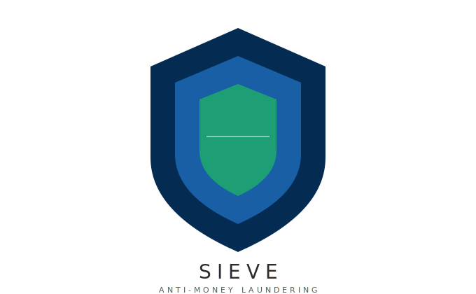
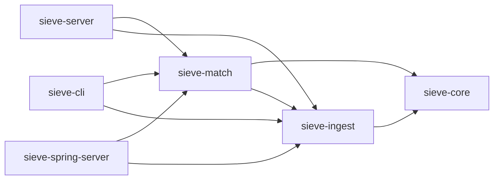

<p align="center">
  
</p>

<p align="center">
  <a href=""></a>
  <a href=""></a>
  <a href="LICENSE"></a>
  <a href=""></a>
</p>

**Open-source sanctions screening platform.** A free, open alternative to commercial watchlist screening solutions. Sieve fetches publicly available sanctions lists, normalizes them into a unified entity model, indexes them in memory, and exposes both a CLI and a REST API for screening names.

## Supported Sanctions Lists

| List | Source | Status |
|------|--------|--------|
| OFAC SDN | U.S. Treasury | ✅ Implemented |
| EU Consolidated | European Commission | 🔜 Stub |
| UN Consolidated | UN Security Council | 🔜 Stub |
| UK HMT | HM Treasury | 🔜 Stub |

## Architecture



```
sieve/
├── sieve-core/              # Zero-dependency domain module
├── sieve-address/           # Address normalization (libpostal)
├── sieve-ingest/            # List fetchers and parsers
├── sieve-match/             # Matching engine implementations
├── sieve-server/            # High-performance Vert.x REST API
├── sieve-spring-server/     # Spring Boot REST API (PostgreSQL, Swagger, scheduling)
├── sieve-cli/               # Command-line interface
├── sieve-benchmark/         # Performance benchmarks
└── pom.xml                  # Parent POM
```

## Quick Start

### Prerequisites

- Java 21+
- Maven 3.9+

### Build

```bash
mvn clean verify
```

### CLI Usage

```bash
# Fetch all enabled sanctions lists
java -jar sieve-cli/target/sieve-cli-0.1.0-SNAPSHOT.jar fetch

# Screen a name
java -jar sieve-cli/target/sieve-cli-0.1.0-SNAPSHOT.jar screen "John Doe"

# Screen with options
java -jar sieve-cli/target/sieve-cli-0.1.0-SNAPSHOT.jar screen "John Doe" --threshold=0.85 --list=ofac-sdn

# View index statistics
java -jar sieve-cli/target/sieve-cli-0.1.0-SNAPSHOT.jar stats
```

**Exit codes:** `0` = no match, `1` = match found, `2` = error (CI/CD friendly).

### REST API

Two server implementations are available with **identical API endpoints**:

| Server | Module | Use case |
|--------|--------|----------|
| **Vert.x** | `sieve-server` | Maximum throughput, minimal overhead, in-memory only |
| **Spring Boot** | `sieve-spring-server` | PostgreSQL persistence, Swagger, scheduled refresh, actuator |

```bash
# Option 1: Vert.x (high-performance)
java -jar sieve-server/target/sieve-server-0.1.0-SNAPSHOT.jar

# Option 2: Spring Boot (full-featured)
java -jar sieve-spring-server/target/sieve-spring-server-0.1.0-SNAPSHOT.jar
```

The Vert.x server accepts CLI flags and environment variables:

```bash
java -jar sieve-server/target/sieve-server-0.1.0-SNAPSHOT.jar \
  --port 9090 --threshold 0.85 --eu true --uk true
```

| Flag | Env var | Default |
|------|---------|---------|
| `--port` | `SIEVE_PORT` | `8080` |
| `--threshold` | `SIEVE_THRESHOLD` | `0.80` |
| `--max-results` | `SIEVE_MAX_RESULTS` | `50` |
| `--ofac` | `SIEVE_OFAC_ENABLED` | `true` |
| `--eu` | `SIEVE_EU_ENABLED` | `false` |
| `--un` | `SIEVE_UN_ENABLED` | `false` |
| `--uk` | `SIEVE_UK_ENABLED` | `false` |

#### Endpoints

```bash
# Screen a name
curl -X POST http://localhost:8080/api/v1/screen \
  -H "Content-Type: application/json" \
  -d '{"name": "John Doe", "threshold": 0.80}'

# List status
curl http://localhost:8080/api/v1/lists

# Refresh lists
curl -X POST http://localhost:8080/api/v1/lists/refresh

# Health check
curl http://localhost:8080/api/v1/health
```

## Matching Algorithms

- **Exact Match** — Normalized case-insensitive exact comparison (score: 1.0 or 0.0)
- **Fuzzy Match** — Jaro-Winkler similarity (implemented from scratch, no external dependencies)
- **Composite** — Runs both engines, deduplicates by entity, keeps highest score

## Configuration

- **Vert.x server** — configured via CLI flags and environment variables (see table above)
- **Spring Boot server** — see [`sieve-spring-server/src/main/resources/application.yml`](sieve-spring-server/src/main/resources/application.yml)

## Docker

```bash
# Spring Boot server (with PostgreSQL)
docker compose up sieve-spring-server

# Vert.x server (standalone, in-memory)
docker compose up sieve-server
```

## Tech Stack

- **Java 21** — Records, sealed interfaces, pattern matching, virtual threads
- **Vert.x 4.5 + Netty** — High-performance server (event-loop, zero-copy I/O)
- **Spring Boot 3.3** — Full-featured server (PostgreSQL, Swagger, scheduling)
- **Picocli** — CLI framework (no Spring dependency)
- **StAX** — Streaming XML parsing for large sanctions lists
- **JUnit 5 + AssertJ** — Testing

## License

[MIT](LICENSE) — see [LICENSE](LICENSE) for details.
