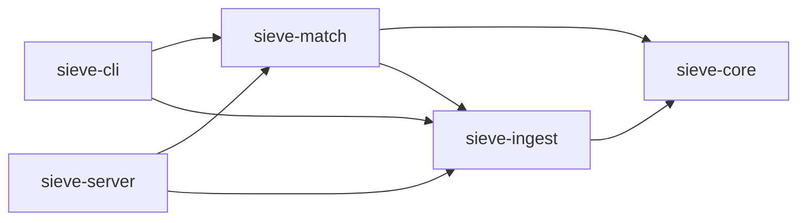

# Sieve

[]()
[]()
[](LICENSE)
[]()

**Open-source sanctions screening platform.** A free, open alternative to commercial watchlist screening solutions. Sieve fetches publicly available sanctions lists, normalizes them into a unified entity model, indexes them in memory, and exposes both a CLI and a REST API for screening names.

## Supported Sanctions Lists

| List | Source | Status |
|------|--------|--------|
| OFAC SDN | U.S. Treasury | ✅ Implemented |
| EU Consolidated | European Commission | 🔜 Stub |
| UN Consolidated | UN Security Council | 🔜 Stub |
| UK HMT | HM Treasury | 🔜 Stub |

## Architecture



```
sieve/
├── sieve-core/          # Zero-dependency domain module
├── sieve-ingest/        # List fetchers and parsers
├── sieve-match/         # Matching engine implementations
├── sieve-server/        # Spring Boot REST API
├── sieve-cli/           # Command-line interface
└── pom.xml              # Parent POM
```

## Quick Start

### Prerequisites

- Java 21+
- Maven 3.9+

### Build

```bash
mvn clean verify
```

### CLI Usage

```bash
# Fetch all enabled sanctions lists
java -jar sieve-cli/target/sieve-cli-0.1.0-SNAPSHOT.jar fetch

# Screen a name
java -jar sieve-cli/target/sieve-cli-0.1.0-SNAPSHOT.jar screen "John Doe"

# Screen with options
java -jar sieve-cli/target/sieve-cli-0.1.0-SNAPSHOT.jar screen "John Doe" --threshold=0.85 --list=ofac-sdn

# View index statistics
java -jar sieve-cli/target/sieve-cli-0.1.0-SNAPSHOT.jar stats
```

**Exit codes:** `0` = no match, `1` = match found, `2` = error (CI/CD friendly).

### REST API

```bash
# Start the server
java -jar sieve-server/target/sieve-server-0.1.0-SNAPSHOT.jar
```

#### Endpoints

```bash
# Screen a name
curl -X POST http://localhost:8080/api/v1/screen \
  -H "Content-Type: application/json" \
  -d '{"name": "John Doe", "threshold": 0.80}'

# List status
curl http://localhost:8080/api/v1/lists

# Refresh lists
curl -X POST http://localhost:8080/api/v1/lists/refresh

# Health check
curl http://localhost:8080/api/v1/health
```

## Matching Algorithms

- **Exact Match** — Normalized case-insensitive exact comparison (score: 1.0 or 0.0)
- **Fuzzy Match** — Jaro-Winkler similarity (implemented from scratch, no external dependencies)
- **Composite** — Runs both engines, deduplicates by entity, keeps highest score

## Configuration

See [`sieve-server/src/main/resources/application.yml`](sieve-server/src/main/resources/application.yml) for all available configuration options.

## Tech Stack

- **Java 21** — Records, sealed interfaces, pattern matching, virtual threads
- **Spring Boot 3.3** — REST API, configuration, scheduling
- **Picocli** — CLI framework (no Spring dependency)
- **StAX** — Streaming XML parsing for large sanctions lists
- **JUnit 5 + AssertJ** — Testing

## License

[MIT](LICENSE) — see [LICENSE](LICENSE) for details.
