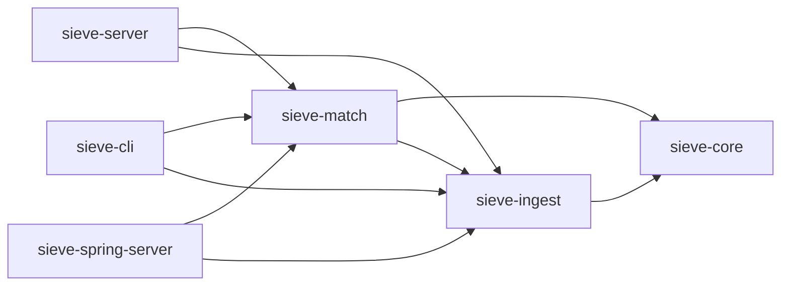

<p align="center">
  
</p>

<p align="center">
  <a href="https://github.com/AbgarSim/sieve-aml/actions/workflows/ci.yml"></a>
  <a href="https://abgarsim.github.io/sieve-aml/"></a>
  <a href=""></a>
  <a href="LICENSE"></a>
  <a href=""></a>
</p>

**Open-source sanctions screening platform.** A free, open alternative to commercial watchlist screening solutions. Sieve fetches publicly available sanctions lists, normalizes them into a unified entity model, indexes them in memory, and exposes both a CLI and a REST API for screening names.

## Supported Sanctions Lists

**33 providers** across 24 jurisdictions. All lists are fetched from official government endpoints, parsed into a unified entity model, and indexed in memory for screening.

### International

| Provider | Source | Format | Entities |
|----------|--------|--------|----------|
| UN Consolidated | UN Security Council | XML | ~800 |

### North America

| Provider | Source | Format | Entities |
|----------|--------|--------|----------|
| OFAC SDN | U.S. Treasury — Specially Designated Nationals | XML | ~12,000 |
| OFAC Non-SDN | U.S. Treasury — Non-SDN Consolidated | XML | ~600 |
| US Trade CSL | U.S. Commerce Dept — Consolidated Screening List | JSON | ~12,500 |
| US BIS Entity List | U.S. Commerce Dept — Bureau of Industry and Security Entity List (from the CSL) | JSON | ~3,400 |
| US BIS MEU | U.S. Commerce Dept — Bureau of Industry and Security Military End-User List (from the CSL) | JSON | ~70 |
| Canada Consolidated | Global Affairs Canada (SEMA, FACFOA, Terrorists) | XML | ~2,700 |

### Europe

| Provider | Source | Format | Entities |
|----------|--------|--------|----------|
| EU Consolidated | European Commission — Financial Sanctions | XML | ~5,900 |
| EU Journal | EU Official Journal designations | XML | ~5,900 |
| EU Sanctions Map | EU Sanctions Map API | JSON | ~1,000 |
| EU Travel Bans | EU Travel Bans list | XML | ~5,900 |
| UK HMT | HM Treasury — Financial Sanctions | XML | ~4,000 |
| CH SECO | Switzerland — State Secretariat for Economic Affairs | XML | ~5,700 |
| FR Trésor | France — Direction Générale du Trésor | JSON | ~6,000 |
| BE FOD | Belgium — FOD/SPF Finance | JSON | ~800 |
| PL MSWiA | Poland — Ministry of Interior and Administration | HTML | ~560 |
| LV FIU | Latvia — Financial Intelligence Unit | XML | ~160 |
| AR RePET | Argentina — Ministry of Justice terrorism registry (RePET) | JSON | ~700 |
| IN MHA | India — Ministry of Home Affairs individual terrorists under UAPA | HTML | ~60 |
| US FBI Wanted | U.S. Federal Bureau of Investigation — wanted persons (open posters naming a suspect) | JSON | ~500 |
| EU Most Wanted | Europol / ENFAST — Europe's most wanted fugitives | HTML | ~50 |
| World Bank Debarred | World Bank Group — firms and individuals debarred from Bank-financed contracts | JSON | ~1,500 |
| Wikidata PEPs | Wikidata — living holders of national offices (heads of state and government, ministers, central bank governors, military chiefs, members of parliament, judges, deputy ministers, ambassadors, attorneys general, party leaders) and the heads of first-level regions (state governors, regional premiers), current or within 5 years, plus their living relatives and close associates (spouses, partners, children, parents, siblings, relatives, business partners), each linked to their PEP | JSON (SPARQL) | ~81,000 PEPs, ~7,500 RCAs |
| MC Fund Freezing | Monaco — Budget and Treasury Dept | JSON | ~6,000 |
| MD Terror | Moldova — Security and Intelligence Service | XLSX | ~710 |

### Asia-Pacific

| Provider | Source | Format | Entities |
|----------|--------|--------|----------|
| AU DFAT | Australia — Dept of Foreign Affairs and Trade | XLSX | ~900 |
| NZ Russia | New Zealand — Russia Sanctions Register | JSON | ~1,900 |
| JP MoF | Japan — Ministry of Finance | CSV | ~4,200 |

### Middle East & Africa

| Provider | Source | Format | Entities |
|----------|--------|--------|----------|
| IL WMD/Terror | Israel — NBCTF (Counter Terror Financing) | XLSX | ~900 |
| TR MASAK | Turkey — Financial Crimes Investigation Board | XLSX | ~1,800 |
| QA NCTC | Qatar — National Counter Terrorism Committee | XML | ~800 |
| ZA FIC | South Africa — Financial Intelligence Centre | XML | ~800 |

### Not Yet Available

| Provider | Source | Status |
|----------|--------|--------|
| UA NSDC | Ukraine — National Security and Defence Council | ⏸ Requires API key (email sanctions@rnbo.gov.ua) |

## Architecture


```mermaid
graph LR
    CLI[sieve-cli] --> MATCH[sieve-match]
    VERTX[sieve-server] --> MATCH
    SPRING[sieve-spring-server] --> MATCH
    MATCH --> CORE[sieve-core]
    MATCH --> INGEST[sieve-ingest]
    VERTX --> INGEST
    SPRING --> INGEST
    CLI --> INGEST
    INGEST --> CORE
```

```
sieve/
├── sieve-core/              # Zero-dependency domain module
├── sieve-address/           # Address normalization (libpostal)
├── sieve-ingest/            # List fetchers and parsers
├── sieve-match/             # Matching engine implementations
├── sieve-server/            # High-performance Vert.x REST API
├── sieve-spring-server/     # Spring Boot REST API (PostgreSQL, Swagger, scheduling)
├── sieve-cli/               # Command-line interface
├── sieve-benchmark/         # Performance benchmarks
└── pom.xml                  # Parent POM
```

## Quick Start

### Prerequisites

- Java 21+
- Maven 3.9+

### Build

```bash
mvn clean verify
```

### CLI Usage

```bash
# Fetch all enabled sanctions lists
java -jar sieve-cli/target/sieve-cli-0.1.0-SNAPSHOT.jar fetch

# Screen a name
java -jar sieve-cli/target/sieve-cli-0.1.0-SNAPSHOT.jar screen "John Doe"

# Screen with options
java -jar sieve-cli/target/sieve-cli-0.1.0-SNAPSHOT.jar screen "John Doe" --threshold=0.85 --list=ofac-sdn

# View index statistics
java -jar sieve-cli/target/sieve-cli-0.1.0-SNAPSHOT.jar stats
```

**Exit codes:** `0` = no match, `1` = match found, `2` = error (CI/CD friendly).

### REST API

Two server implementations are available with **identical API endpoints**:

| Server | Module | Use case |
|--------|--------|----------|
| **Vert.x** | `sieve-server` | Maximum throughput, minimal overhead, in-memory only |
| **Spring Boot** | `sieve-spring-server` | PostgreSQL persistence, Swagger, scheduled refresh, actuator |

```bash
# Option 1: Vert.x (high-performance)
java -jar sieve-server/target/sieve-server-0.1.0-SNAPSHOT.jar

# Option 2: Spring Boot (full-featured)
java -jar sieve-spring-server/target/sieve-spring-server-0.1.0-SNAPSHOT.jar
```

The Vert.x server accepts CLI flags and environment variables:

```bash
java -jar sieve-server/target/sieve-server-0.1.0-SNAPSHOT.jar \
  --port 9090 --threshold 0.85 --eu true --uk true
```

| Flag | Env var | Default |
|------|---------|---------|
| `--port` | `SIEVE_PORT` | `8080` |
| `--threshold` | `SIEVE_THRESHOLD` | `0.80` |
| `--max-results` | `SIEVE_MAX_RESULTS` | `50` |
| `--ofac` | `SIEVE_OFAC_ENABLED` | `true` |
| `--eu` | `SIEVE_EU_ENABLED` | `false` |
| `--un` | `SIEVE_UN_ENABLED` | `false` |
| `--uk` | `SIEVE_UK_ENABLED` | `false` |

#### Endpoints

```bash
# Screen a name
curl -X POST http://localhost:8080/api/v1/screen \
  -H "Content-Type: application/json" \
  -d '{"name": "John Doe", "threshold": 0.80}'

# List status
curl http://localhost:8080/api/v1/lists

# Refresh lists
curl -X POST http://localhost:8080/api/v1/lists/refresh

# Health check
curl http://localhost:8080/api/v1/health
```

## Matching Algorithms

- **Exact Match** — Normalized case-insensitive exact comparison (score: 1.0 or 0.0)
- **Fuzzy Match** — Jaro-Winkler similarity (implemented from scratch, no external dependencies)
- **Composite** — Runs both engines, deduplicates by entity, keeps highest score

## Configuration

- **Vert.x server** — configured via CLI flags and environment variables (see table above)
- **Spring Boot server** — see [`sieve-spring-server/src/main/resources/application.yml`](sieve-spring-server/src/main/resources/application.yml)

## Dashboard

A public dashboard at **[abgarsim.github.io/sieve-aml](https://abgarsim.github.io/sieve-aml/)** is rebuilt every night from all 33 lists: entity totals per list, a world map of sanctioned entities by nationality and address, data quality per source, benchmarks, and a searchable list of every record with a full data card. Politically exposed persons are counted on the dashboard but their records are not published there. The data comes from `sieve snapshot`; the site lives in [`dashboard/`](dashboard/README.md).

```bash
java -jar sieve-cli/target/sieve-cli-0.1.0-SNAPSHOT.jar snapshot --out snapshot   # write the data files
cd dashboard && npm install && npm run dev                                     # serve the site on that snapshot
```

## Docker

```bash
# Spring Boot server (with PostgreSQL)
docker compose up sieve-spring-server

# Vert.x server (standalone, in-memory)
docker compose up sieve-server
```

## Tech Stack

- **Java 21** — Records, sealed interfaces, pattern matching, virtual threads
- **Vert.x 4.5 + Netty** — High-performance server (event-loop, zero-copy I/O)
- **Spring Boot 3.3** — Full-featured server (PostgreSQL, Swagger, scheduling)
- **Picocli** — CLI framework (no Spring dependency)
- **StAX** — Streaming XML parsing for large sanctions lists
- **Jackson** — JSON parsing
- **Apache POI** — XLSX spreadsheet parsing
- **Playwright** — Headless browser for JS-rendered sites (TR MASAK, IL NBCTF)
- **JUnit 5 + AssertJ** — Testing (parallel execution)

## License

[MIT](LICENSE) — see [LICENSE](LICENSE) for details.
