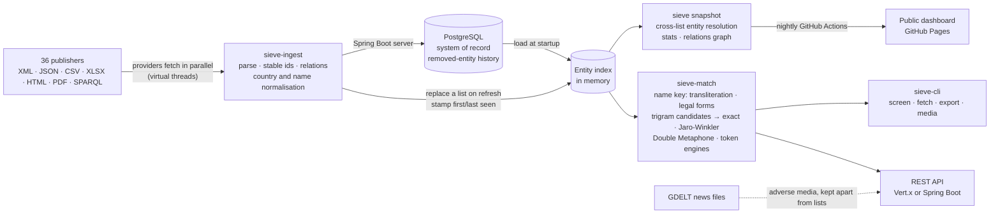
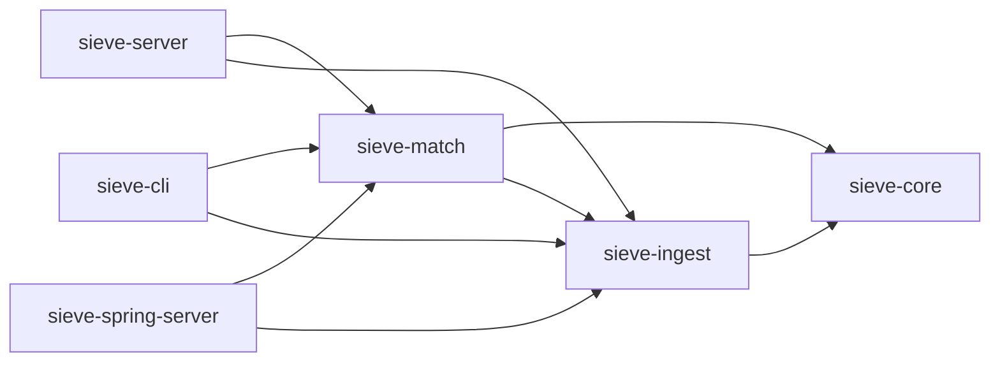

<p align="center">
  
</p>

<p align="center">
  <a href="https://github.com/AbgarSim/sieve-aml/actions/workflows/ci.yml"></a>
  <a href="https://abgarsim.github.io/sieve-aml/"></a>
  <a href="LICENSE"></a>
  
</p>

**Open-source sanctions and risk-data screening platform.** A free, open alternative to commercial watchlist screening solutions. Sieve fetches sanctions, export-control, debarment, wanted-person and politically exposed person (PEP) lists from the bodies that publish them, normalizes them into one entity model with relations and provenance, and screens names against them through a CLI, two REST servers and a public dashboard.

## Project status

| Area | State |
|------|-------|
| Data coverage | 36 list sources, 35 fetched nightly (Ukraine waits on an API key); roadmap Phase 1 complete |
| Matching | Exact, Jaro-Winkler, Double Metaphone and token engines on one transliterating name key; cross-list entity resolution in the published snapshot |
| Storage | In memory (Vert.x server, CLI); PostgreSQL system of record with first-seen and last-seen per value (Spring Boot server) |
| Interfaces | CLI, REST API (two servers), entity import and export in an open JSON-lines format, public dashboard |
| Measured | Throughput, latency, memory and a labelled matching evaluation on the real lists: see [Performance and accuracy](#performance-and-accuracy) |
| Next | Matching quality (roadmap Phase 2), then operations and compliance features: see [ROADMAP.md](ROADMAP.md) |

Releases are not yet tagged; `main` is built and tested on every change and the dashboard is rebuilt from it every night. Changes are listed in [CHANGELOG.md](CHANGELOG.md).

## Demo

Every night the [dashboard](#dashboard) is rebuilt from `main` and the night's lists; a script then drives the result in a browser, records what it sees, and calls the REST server and the CLI the way an integration would. So the demo is the application as built last night, never a staged recording; when a night's recording fails, the previous one stays up, and the page says which commit and date it was recorded from. **[abgarsim.github.io/sieve-aml/#/demo](https://abgarsim.github.io/sieve-aml/#/demo)** has the video, the steps as screenshots, and the REST and CLI transcripts.

<p align="center">
  <a href="https://abgarsim.github.io/sieve-aml/#/demo"></a>
</p>

The screenshots the recorder took last night: the overview, one person's profile combining their records across lists, and that person's association graph.

<p>
  
  
  
</p>

The recorder is [`dashboard/demo/record.mjs`](dashboard/demo/record.mjs); `npm run demo` in `dashboard/` records one locally against `npm run preview` (see [dashboard/README.md](dashboard/README.md#demo)).

## Supported Sanctions Lists

**36 list sources**: 20 national governments, the United Nations, the European Union (5 lists, including Europol's most wanted), the World Bank, and two open registries (Wikidata for PEPs, GLEIF for state-owned and sanction-linked companies). Each list is fetched from its publisher, parsed into the unified entity model and indexed for screening; 35 are fetched today and Ukraine's list waits on an API key.

### International

| Provider | Source | Format | Entities |
|----------|--------|--------|----------|
| UN Consolidated | UN Security Council; parties the comments cite by reference number become relations, typed by the words before them (member of, brother of, leader of) | XML | ~800 |

### North America

| Provider | Source | Format | Entities |
|----------|--------|--------|----------|
| OFAC SDN | U.S. Treasury — Specially Designated Nationals; every digital currency address an entry lists is also a crypto wallet entity of its own, linked to its holder; the "Linked To" names in an entry's remarks and the owner a vessel record names become relations to the entries they name | XML | ~20,500 (incl. ~1,050 wallets) |
| OFAC Non-SDN | U.S. Treasury — Non-SDN Consolidated; same parser as the SDN list, so entries carry aliases, addresses, identifiers and wallets, and "Linked To" names in remarks become relations to the entries they name | XML | ~500 |
| US Trade CSL | U.S. Commerce Dept — Consolidated Screening List | JSON | ~12,500 |
| US BIS Entity List | U.S. Commerce Dept — Bureau of Industry and Security Entity List (from the CSL) | JSON | ~3,400 |
| US BIS MEU | U.S. Commerce Dept — Bureau of Industry and Security Military End-User List (from the CSL) | JSON | ~70 |
| Canada Consolidated | Global Affairs Canada (SEMA, FACFOA, Terrorists) | XML | ~2,700 |

### Europe

| Provider | Source | Format | Entities |
|----------|--------|--------|----------|
| EU Consolidated | European Commission — Financial Sanctions; entries a remark names in full become relations, typed by the words before the name | XML | ~5,900 |
| EU Journal | EU Official Journal designations | XML | ~5,900 |
| EU Sanctions Map | EU Sanctions Map API | JSON | ~1,000 |
| EU Travel Bans | EU Travel Bans list | XML | ~5,900 |
| UK HMT | HM Treasury — Financial Sanctions | XML | ~4,000 |
| CH SECO | Switzerland — State Secretariat for Economic Affairs | XML | ~5,700 |
| FR Trésor | France — Direction Générale du Trésor | JSON | ~6,000 |
| BE FOD | Belgium — FOD/SPF Finance | JSON | ~800 |
| PL MSWiA | Poland — Ministry of Interior and Administration | HTML | ~560 |
| LV FIU | Latvia — Financial Intelligence Unit | XML | ~160 |
| AR RePET | Argentina — Ministry of Justice terrorism registry (RePET) | JSON | ~700 |
| IN MHA | India — Ministry of Home Affairs individual terrorists under UAPA | HTML | ~60 |
| IN MHA Organisations | India — Ministry of Home Affairs banned organisations under UAPA: terrorist organisations of the First Schedule and unlawful associations under Section 3, read from the ministry's PDFs | PDF | ~75 |
| US FBI Wanted | U.S. Federal Bureau of Investigation — wanted persons (open posters naming a suspect) | JSON | ~500 |
| EU Most Wanted | Europol / ENFAST — Europe's most wanted fugitives | HTML | ~50 |
| World Bank Debarred | World Bank Group — firms and individuals debarred from Bank-financed contracts | JSON | ~1,500 |
| Wikidata PEPs | Wikidata — living holders of national offices (heads of state and government, ministers, central bank governors, military chiefs, members of parliament, judges, deputy ministers, ambassadors, attorneys general, party leaders) and the heads of first-level regions (state governors, regional premiers), current or within 5 years, plus their living relatives and close associates (spouses, partners, children, parents, siblings, relatives, business partners), each linked to their PEP; each PEP's listing reasons cite the directive category of the office and the state's own entry in the EU list of prominent public functions (OJ C/2023/724), which Sieve ships as a reference table | JSON (SPARQL) | ~81,000 PEPs, ~7,500 RCAs |
| GLEIF State-Owned | Global Legal Entity Identifier Foundation — companies whose direct or ultimate accounting parent in the LEI register is a government entity (states, regions, cities, sovereign and public pension funds), with their government owners and the ownership links between them; LEI, registration number and BIC as identifiers | JSON (API) + CSV (relationship file) | ~1,300 |
| GLEIF Sanction-Linked | Global Legal Entity Identifier Foundation — companies whose accounts a party on the OFAC SDN or EU consolidated list consolidates, directly or through other companies, found by following the LEI register's relationship records down from the LEIs those lists state (the OFAC and EU 50% rules); each carries a link to the listed owner's record and is left out when it is listed itself | JSON (API) + CSV (relationship file) | ~70 |
| MC Fund Freezing | Monaco — Budget and Treasury Dept | JSON | ~6,000 |
| MD Terror | Moldova — Security and Intelligence Service | XLSX | ~710 |

### Asia-Pacific

| Provider | Source | Format | Entities |
|----------|--------|--------|----------|
| AU DFAT | Australia — Dept of Foreign Affairs and Trade | XLSX | ~900 |
| NZ Russia | New Zealand — Russia Sanctions Register | JSON | ~1,900 |
| JP MoF | Japan — Ministry of Finance | CSV | ~4,200 |

### Middle East & Africa

| Provider | Source | Format | Entities |
|----------|--------|--------|----------|
| IL WMD/Terror | Israel — NBCTF (Counter Terror Financing) | XLSX | ~900 |
| TR MASAK | Turkey — Financial Crimes Investigation Board | XLSX | ~1,800 |
| QA NCTC | Qatar — National Counter Terrorism Committee | XML | ~800 |
| ZA FIC | South Africa — Financial Intelligence Centre | XML | ~800 |

### Not Yet Available

| Provider | Source | Status |
|----------|--------|--------|
| UA NSDC | Ukraine — National Security and Defence Council | ⏸ Requires API key (email sanctions@rnbo.gov.ua) |
| KZ AFM | Kazakhstan — Agency for Financial Monitoring | ⏸ afm.gov.kz does not answer requests from outside Kazakhstan, and the former afmrk.gov.kz host is gone |
| HK | Hong Kong — Commerce and Economic Development Bureau | — No list of its own: the gazette republishes the UN lists, which Sieve already carries |
| SG MAS | Singapore — Monetary Authority of Singapore | — No machine-readable list of its own: MAS republishes the UN lists, which Sieve already carries |

## Architecture

How data moves through Sieve:


```mermaid
flowchart LR
    SRC["36 publishers<br/>XML · JSON · CSV · XLSX · HTML · PDF · SPARQL"] -->|"providers fetch in parallel<br/>(virtual threads)"| ING["sieve-ingest<br/>parse · stable ids · relations<br/>country and name normalisation"]
    ING -->|"replace a list on refresh<br/>stamp first/last seen"| IDX[("Entity index<br/>in memory")]
    ING -->|Spring Boot server| PG[("PostgreSQL<br/>system of record<br/>removed-entity history")]
    PG -->|load at startup| IDX
    IDX --> MATCH["sieve-match<br/>name key: transliteration · legal forms<br/>trigram candidates → exact · Jaro-Winkler<br/>Double Metaphone · token engines"]
    MATCH --> API["REST API<br/>Vert.x or Spring Boot"]
    MATCH --> CLI["sieve-cli<br/>screen · fetch · export · media"]
    IDX --> SNAP["sieve snapshot<br/>cross-list entity resolution<br/>stats · relations graph"]
    SNAP -->|nightly GitHub Actions| DASH["Public dashboard<br/>GitHub Pages"]
    GDELT["GDELT news files"] -.->|adverse media, kept apart from lists| API
```

Module dependencies:


```mermaid
graph LR
    CLI[sieve-cli] --> MATCH[sieve-match]
    VERTX[sieve-server] --> MATCH
    SPRING[sieve-spring-server] --> MATCH
    MATCH --> CORE[sieve-core]
    MATCH --> INGEST[sieve-ingest]
    VERTX --> INGEST
    SPRING --> INGEST
    CLI --> INGEST
    INGEST --> CORE
```

```
sieve/
├── sieve-core/              # Zero-dependency domain module
├── sieve-address/           # Address normalization (libpostal)
├── sieve-ingest/            # List fetchers and parsers
├── sieve-match/             # Matching engine implementations
├── sieve-server/            # High-performance Vert.x REST API
├── sieve-spring-server/     # Spring Boot REST API (PostgreSQL, Swagger, scheduling)
├── sieve-cli/               # Command-line interface
├── sieve-benchmark/         # Performance benchmarks
└── pom.xml                  # Parent POM
```

## Quick Start

### Prerequisites

- Java 21+
- Maven 3.9+

### Build

```bash
mvn clean verify
```

### CLI Usage

```bash
# Fetch all enabled sanctions lists
java -jar sieve-cli/target/sieve-cli-0.1.0-SNAPSHOT.jar fetch

# Screen a name
java -jar sieve-cli/target/sieve-cli-0.1.0-SNAPSHOT.jar screen "John Doe"

# Screen with options
java -jar sieve-cli/target/sieve-cli-0.1.0-SNAPSHOT.jar screen "John Doe" --threshold=0.85 --list=ofac-sdn

# View index statistics
java -jar sieve-cli/target/sieve-cli-0.1.0-SNAPSHOT.jar stats
```

**Exit codes:** `0` = no match, `1` = match found, `2` = error (CI/CD friendly).

### REST API

Two server implementations are available with **identical API endpoints**:

| Server | Module | Use case |
|--------|--------|----------|
| **Vert.x** | `sieve-server` | Maximum throughput, minimal overhead, in-memory only |
| **Spring Boot** | `sieve-spring-server` | PostgreSQL persistence, Swagger, scheduled refresh, actuator |

```bash
# Option 1: Vert.x (high-performance)
java -jar sieve-server/target/sieve-server-0.1.0-SNAPSHOT.jar

# Option 2: Spring Boot (full-featured)
java -jar sieve-spring-server/target/sieve-spring-server-0.1.0-SNAPSHOT.jar
```

The Vert.x server accepts CLI flags and environment variables:

```bash
java -jar sieve-server/target/sieve-server-0.1.0-SNAPSHOT.jar \
  --port 9090 --threshold 0.85 --eu true --uk true
```

| Flag | Env var | Default |
|------|---------|---------|
| `--port` | `SIEVE_PORT` | `8080` |
| `--threshold` | `SIEVE_THRESHOLD` | `0.80` |
| `--max-results` | `SIEVE_MAX_RESULTS` | `50` |
| `--ofac` | `SIEVE_OFAC_ENABLED` | `true` |
| `--eu` | `SIEVE_EU_ENABLED` | `true` |
| `--un` | `SIEVE_UN_ENABLED` | `true` |
| `--uk` | `SIEVE_UK_ENABLED` | `true` |

Every other list is always fetched by the Vert.x server.

#### Endpoints

```bash
# Screen a name
curl -X POST http://localhost:8080/api/v1/screen \
  -H "Content-Type: application/json" \
  -d '{"name": "John Doe", "threshold": 0.80}'

# List status
curl http://localhost:8080/api/v1/lists

# Refresh lists
curl -X POST http://localhost:8080/api/v1/lists/refresh

# Health check
curl http://localhost:8080/api/v1/health

# The EU list of prominent public functions: a summary, then one jurisdiction's functions of one category
curl http://localhost:8080/api/v1/pep/functions
curl "http://localhost:8080/api/v1/pep/functions/DE?category=a"
```

## Matching Algorithms

Every name, listed or queried, is reduced to one matching key: other scripts are romanised (Cyrillic by BGN/PCGN, Greek by UNGEGN, Chinese and Korean per syllable, others through ICU), accents are folded, punctuation is normalised and legal forms such as "LLC" or "OOO" are set aside for organisations. Names are stored and shown as the list wrote them.

- **Exact** — equal matching keys (score 1.0)
- **Fuzzy** — Jaro-Winkler similarity over aligned name parts, implemented from scratch
- **Phonetic** — Double Metaphone codes, so spellings that sound alike meet
- **Token** — each query word scored against its best-matching listed word in any order, so word order and extra middle names matter less
- **Composite** — runs all four over candidates from a trigram index and keeps each entity's best score; a hit on a single part of a name (a lone first name or surname) scores lower than a full-name hit

The published snapshot also resolves entities across lists: records of the same person or company on different lists are grouped when their names agree and their dates of birth or identifiers do not contradict it.

## Performance and accuracy

The [Benchmark workflow](.github/workflows/benchmark.yml) fetches every list live and measures Sieve on it. The latest published run, on 5 October 2026 on a 4-vCPU GitHub runner against 210,833 records and 458,635 names from 34 lists, screened by name only:

| Measure | Result |
|---------|--------|
| Index build and memory | 4.9 s to build the name cache and trigram index; 790 MB of heap |
| Latency, one thread | p50 51 ms, p95 136 ms, p99 215 ms |
| Throughput, in process | about 38 screenings/s at 4 threads and above (3.3 million a day) |
| Throughput over HTTP (Vert.x server) | about 45 requests/s from 4 clients up, p50 74 ms at 4 clients; 3.3 GB resident with every list loaded |
| Same entity found on another list (2,000 pairs tied by a shared identifier) | 93.4% at threshold 0.80; 86.5% when the two lists spell the name differently |
| Spelling variants found (typos, transliteration, word order) | 96.5% at 0.80 |
| Unlisted names that raise an alert (false positives) | 99.4% at 0.80, 73.0% at 0.90, 44.1% at 0.95 |

Name-only screening of common names against this many records almost always finds a similar listed name, and 5.6% of the unlisted test names are exact namesakes of a listed person. Screening on date of birth, country and identifiers, and calibrating each engine's scores, are the next matching milestones ([ROADMAP.md](ROADMAP.md)). Method, every table, limits of the evaluation and the earlier OFAC SDN-only results are in [docs/performance/benchmarks.rst](docs/performance/benchmarks.rst); [sieve-benchmark](sieve-benchmark/README.md) reproduces them.

## Adverse Media (experimental)

Sieve can look up recent news articles that name a person or organisation in a crime, corruption, sanctions or terrorism context, using the open [GDELT](https://www.gdeltproject.org/) news index. The articles are **candidates for an analyst to read, never a match**: they are kept apart from the curated lists, never stored as entities, never change a screening score or the `screen` exit code, and an empty result does not clear a name.

Two ways to ask GDELT:

- **`gkg` (default)**: reads GDELT's Global Knowledge Graph files, which GDELT publishes every 15 minutes with the people, organisations and themes it found in the online news it processed, in English and machine-translated from other languages. Sieve keeps the articles tagged with adverse themes (money laundering, corruption, bribery or fraud, sanctions, terrorism, arrests, organised crime, trafficking and the like) for a rolling window and compares the searched name with the names in them, on the same matching key as list screening. Each file is about 5 MB in English and 12 MB translated, so the server reads a few hours at startup and then each new file as it appears.
- **`doc-api`**: asks GDELT's full-text search API per name, which covers the last three months. GDELT allows one request every five seconds and often refuses requests from shared cloud addresses, so Sieve answers `UNAVAILABLE` rather than queueing callers.

```bash
# CLI: read the last 6 hours of news files and look up names (exit 0 whatever it finds, 2 if GDELT could not be read)
java -jar sieve-cli/target/sieve-cli-0.1.0-SNAPSHOT.jar media "John Doe" "Acme Holdings"
java -jar sieve-cli/target/sieve-cli-0.1.0-SNAPSHOT.jar media --index doc-api --days 30 "John Doe"

# Spring Boot server, with sieve.adverse-media.enabled=true (off by default)
curl -X POST http://localhost:8080/api/v1/adverse-media \
  -H "Content-Type: application/json" \
  -d '{"name": "John Doe", "lookbackDays": 30, "maxArticles": 10}'
```

Each article carries its URL, headline, site, language, the date GDELT saw it, the adverse terms or themes that made it a candidate and, for `gkg`, the name in the article that was taken for the searched one. Names in GDELT are machine-extracted and an adverse article may be adverse for someone else it names, so every result needs reading.

## Configuration

- **Vert.x server** — configured via CLI flags and environment variables (see table above)
- **Spring Boot server** — see [`sieve-spring-server/src/main/resources/application.yml`](sieve-spring-server/src/main/resources/application.yml)

## Dashboard

A public dashboard at **[abgarsim.github.io/sieve-aml](https://abgarsim.github.io/sieve-aml/)** is rebuilt every night from every list: entity totals per list, a world map of sanctioned entities by nationality and address, data quality per source, benchmarks, a searchable list of every record with a full data card, and the [demo](#demo) recorded from that night's build. Politically exposed persons are counted on the dashboard but their records are not published there. The data comes from `sieve snapshot`; the site lives in [`dashboard/`](dashboard/README.md).

```bash
java -jar sieve-cli/target/sieve-cli-0.1.0-SNAPSHOT.jar snapshot --out snapshot   # write the data files
cd dashboard && npm install && npm run dev                                     # serve the site on that snapshot
```

## Docker

```bash
# Spring Boot server (requires PostgreSQL)
docker compose up sieve-spring

# Vert.x server (standalone, in-memory)
docker compose up sieve-server
```

## Tech Stack

- **Java 21** — Records, sealed interfaces, pattern matching, virtual threads
- **Vert.x 4.5 + Netty** — High-performance server (event-loop, zero-copy I/O)
- **Spring Boot 3.3** — Full-featured server (PostgreSQL, Swagger, scheduling)
- **Picocli** — CLI framework (no Spring dependency)
- **StAX** — Streaming XML parsing for large sanctions lists
- **Jackson** — JSON parsing
- **Apache POI** — XLSX spreadsheet parsing
- **Playwright** — Headless browser for JS-rendered sites (TR MASAK, IL NBCTF)
- **JUnit 5 + AssertJ** — Testing (parallel execution)

## License

[MIT](LICENSE) — see [LICENSE](LICENSE) for details.
